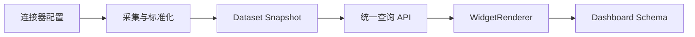

# 元数据驱动的数据接入与可视化平台

## 目标

新增常规数据源时不修改 Go 服务和 React 主程序。平台通过连接器配置、Dataset 契约、转换任务、组件注册表和 Dashboard JSON 完成接入与展示。



## 当前前端原型

- 数据源：新增通用连接器配置，只保存 `authRef`；配置保存在浏览器 LocalStorage。
- Dataset：字段类型、角色、说明、版本、负责人、权限、刷新、缓存、数据预览、血缘和查询协议。
- 组件注册表：组件声明字段角色契约，编排器根据 Dataset Schema 过滤可用组件。
- 大屏：24 列布局、组件选择、字段映射、拖拽排序、JSON 编辑、校验、预览与发布状态。
- 动态渲染：`WidgetRenderer` 根据 `component` 渲染注册组件，数据来自 Dataset。

浏览器存储只是演示实现。生产环境应将数据源、Dataset、Dashboard 和运行记录改为 Go 统一 API。

## Go 服务边界

```text
cmd/server
internal/connector    通用与内置连接器
internal/dataset      Dataset 注册、Schema、查询和快照
internal/pipeline     SQL、JavaScript、Python、Agent 转换编排
internal/scheduler    Cron 与任务队列
internal/dashboard    Dashboard JSON 版本与发布
internal/credential   authRef 解析与密钥访问审计
internal/permission   Dataset 行列权限
internal/lineage      来源、转换和消费关系
internal/webhook      实时接入
workers/python        文档、Excel、PDF 和复杂统计
```

## 统一接口

```http
GET  /api/data-sources
POST /api/data-sources
POST /api/data-sources/{id}/runs

GET  /api/datasets
GET  /api/datasets/{id}/schema
GET  /api/datasets/{id}/query
POST /api/datasets/{id}/query

GET  /api/dashboards
POST /api/dashboards
PUT  /api/dashboards/{id}
POST /api/dashboards/{id}/publish
```

查询响应必须包含 Dataset 版本、快照时间、字段契约和数据行。生产端需要对筛选字段、聚合函数、排序和 limit 设白名单，不能直接拼接客户端 SQL。

## 安全边界

- 数据源配置只保存 `authRef`，凭据由密钥管理服务解析。
- JavaScript 转换运行在隔离 Worker 中，限制 CPU、内存、网络和文件访问。
- Python 使用独立任务 Worker，通过对象存储交换输入输出。
- Agent 输出先经过 JSON Schema 校验，再写入 Dataset Snapshot。
- Dashboard JSON 只引用注册组件，不包含 JSX、HTML 或可执行脚本。
- Dataset 查询在服务端执行权限校验、字段脱敏和审计。

## 数据库核心表

`data_sources`、`connector_instances`、`datasets`、`dataset_fields`、`transform_jobs`、`job_runs`、`dataset_snapshots`、`dashboard_pages`、`dashboard_widgets`、`component_definitions`、`credentials`、`lineage_edges`。

## 生产落地顺序

1. 固化 Dataset Schema 和 Query API。
2. 将 Vortex、CICT、Jira、飞书和 GitLab 转为 Dataset。
3. 将前端演示存储替换为 TanStack Query 调用 Go API。
4. 持久化 Dashboard JSON，并增加草稿、版本、发布与回滚。
5. 增加 SQL、受限 JavaScript 和 Python Worker。
6. 增加权限、审计、血缘和快照保留策略。
7. 特殊组件经过审核进入组件注册表；暂不开放任意远程 React 代码。
